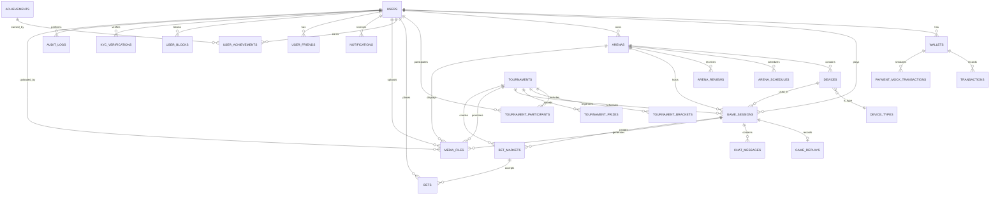

# 🗄️ БАЗА ДАННЫХ GIPERARENA - ПОЛНАЯ СХЕМА

> **Схема:** `giperarena`
> **СУБД:** PostgreSQL 17 (Supabase)
> **Версия документа:** 1.0
> **Дата:** 2025-10-29

---

## 📊 ENTITY RELATIONSHIP DIAGRAM (ERD)



---

## 📋 ТАБЛИЦЫ

### 1. USERS - Пользователи

**Назначение:** Основная таблица пользователей платформы

```sql
CREATE TABLE giperarena.users (
    id UUID PRIMARY KEY DEFAULT gen_random_uuid(),
    username VARCHAR(50) UNIQUE NOT NULL,
    email VARCHAR(255) UNIQUE NOT NULL,
    wallet_address VARCHAR(255) UNIQUE,
    avatar_url TEXT,
    is_verified BOOLEAN DEFAULT FALSE,
    is_active BOOLEAN DEFAULT TRUE,
    metadata JSONB DEFAULT '{}'::jsonb,
    created_at TIMESTAMPTZ DEFAULT NOW(),
    updated_at TIMESTAMPTZ DEFAULT NOW()
);
```

**Индексы:**
- `idx_users_username` - поиск по username
- `idx_users_email` - поиск по email
- `idx_users_wallet_address` - поиск по кошельку (частичный)
- `idx_users_created_at` - сортировка по дате

**Триггеры:**
- `update_users_updated_at` - автообновление `updated_at`

**RLS Policies:**
- Пользователи видят свои данные
- Публичный профиль виден всем (username, avatar, is_verified)

---

### 2. WALLETS - Кошельки

**Назначение:** Балансы GAC и PAC токенов

```sql
CREATE TABLE giperarena.wallets (
    id UUID PRIMARY KEY DEFAULT gen_random_uuid(),
    user_id UUID NOT NULL UNIQUE REFERENCES giperarena.users(id) ON DELETE CASCADE,
    gac_balance DECIMAL(20, 8) DEFAULT 0,  -- GAC blockchain balance (reference)
    pac_balance DECIMAL(20, 8) DEFAULT 0,  -- PAC internal currency (actual)
    staked_gac DECIMAL(20, 8) DEFAULT 0,   -- Staked GAC (mock in DB)
    staking_tier VARCHAR(20) CHECK (staking_tier IN ('none', 'bronze', 'silver', 'gold', 'platinum')),
    total_earned DECIMAL(20, 8) DEFAULT 0,
    total_spent DECIMAL(20, 8) DEFAULT 0,
    created_at TIMESTAMPTZ DEFAULT NOW(),
    updated_at TIMESTAMPTZ DEFAULT NOW()
);
```

**Индексы:**
- `idx_wallets_user_id` - поиск по пользователю

**Constraints:**
- `pac_balance >= 0` - баланс не может быть отрицательным
- `staked_gac >= 0`

**Триггеры:**
- `update_wallets_updated_at`
- `update_staking_tier_on_stake` - автообновление tier при изменении staked_gac

---

### 3. TRANSACTIONS - Транзакции

**Назначение:** Все финансовые операции

```sql
CREATE TABLE giperarena.transactions (
    id UUID PRIMARY KEY DEFAULT gen_random_uuid(),
    user_id UUID NOT NULL REFERENCES giperarena.users(id),
    transaction_type VARCHAR(50) NOT NULL CHECK (transaction_type IN (
        'deposit', 'withdrawal', 'game_fee', 'game_reward',
        'bet', 'bet_payout', 'stake', 'unstake', 'reward'
    )),
    token_type VARCHAR(10) NOT NULL CHECK (token_type IN ('GAC', 'PAC')),
    amount DECIMAL(20, 8) NOT NULL,
    fee DECIMAL(20, 8) DEFAULT 0,
    status VARCHAR(20) DEFAULT 'pending' CHECK (status IN ('pending', 'confirmed', 'failed', 'cancelled')),
    blockchain_tx_hash TEXT,
    reference_id UUID,
    reference_type VARCHAR(50),
    metadata JSONB DEFAULT '{}'::jsonb,
    created_at TIMESTAMPTZ DEFAULT NOW()
);
```

**Индексы:**
- `idx_transactions_user_id`
- `idx_transactions_type`
- `idx_transactions_status`
- `idx_transactions_created_at`

**Триггеры:**
- `update_wallet_balance_on_transaction` - автообновление баланса

---

### 4. PAYMENT_MOCK_TRANSACTIONS - Имитация пополнений

**Назначение:** Тестовые транзакции пополнения PAC

```sql
CREATE TABLE giperarena.payment_mock_transactions (
    id UUID PRIMARY KEY DEFAULT gen_random_uuid(),
    user_id UUID NOT NULL REFERENCES giperarena.users(id),
    payment_method VARCHAR(50) NOT NULL CHECK (payment_method IN (
        'card', 'crypto', 'paypal', 'bank_transfer'
    )),
    amount_usd DECIMAL(10, 2) NOT NULL,
    pac_amount DECIMAL(20, 8) NOT NULL, -- 1:1 with USD
    status VARCHAR(20) DEFAULT 'pending' CHECK (status IN ('pending', 'completed', 'failed')),
    mock_gateway_response JSONB,
    created_at TIMESTAMPTZ DEFAULT NOW(),
    completed_at TIMESTAMPTZ
);
```

**Триггеры:**
- `create_pac_transaction_on_completion` - создаёт транзакцию в `transactions` при завершении

---

### 5. ARENAS - Арены

**Назначение:** Физические локации с устройствами

```sql
CREATE TABLE giperarena.arenas (
    id UUID PRIMARY KEY DEFAULT gen_random_uuid(),
    name VARCHAR(255) NOT NULL,
    description TEXT,
    operator_id UUID NOT NULL REFERENCES giperarena.users(id) ON DELETE CASCADE,
    location_address TEXT,
    location_coordinates GEOGRAPHY(POINT, 4326),
    status VARCHAR(20) DEFAULT 'pending' CHECK (status IN (
        'pending', 'active', 'maintenance', 'offline', 'suspended'
    )),
    arena_type VARCHAR(50) NOT NULL,
    price_per_minute DECIMAL(10, 2) NOT NULL,
    currency VARCHAR(10) DEFAULT 'PAC',
    max_players INTEGER DEFAULT 1,
    operating_hours JSONB,
    features JSONB DEFAULT '[]'::jsonb,
    equipment JSONB DEFAULT '[]'::jsonb,
    media_urls JSONB DEFAULT '{"images": [], "videos": []}'::jsonb,
    rating DECIMAL(3, 2) DEFAULT 0.00,
    total_games INTEGER DEFAULT 0,
    total_revenue DECIMAL(15, 2) DEFAULT 0.00,
    is_verified BOOLEAN DEFAULT FALSE,
    metadata JSONB DEFAULT '{}'::jsonb,
    created_at TIMESTAMPTZ DEFAULT NOW(),
    updated_at TIMESTAMPTZ DEFAULT NOW()
);
```

**Индексы:**
- `idx_arenas_operator_id`
- `idx_arenas_status`
- `idx_arenas_arena_type`
- `idx_arenas_rating`
- `idx_arenas_location` (GIS) - геопоиск
- `idx_arenas_created_at`

**Триггеры:**
- `update_arenas_updated_at`
- `recalculate_arena_rating` - автопересчёт рейтинга при новых отзывах

**Функции:**
- `search_arenas_by_location(lat, lon, radius_km)` - поиск арен в радиусе

---

### 6. DEVICES - Устройства (роботы/дроны)

**Назначение:** Управляемые устройства на аренах

```sql
CREATE TABLE giperarena.devices (
    id UUID PRIMARY KEY DEFAULT gen_random_uuid(),
    arena_id UUID NOT NULL REFERENCES giperarena.arenas(id) ON DELETE CASCADE,
    device_type_id UUID NOT NULL REFERENCES giperarena.device_types(id),
    name VARCHAR(100) NOT NULL,
    model VARCHAR(100),
    serial_number VARCHAR(100) UNIQUE,
    status VARCHAR(20) DEFAULT 'available' CHECK (status IN (
        'available', 'in_use', 'maintenance', 'offline', 'retired'
    )),
    capabilities JSONB DEFAULT '[]'::jsonb,
    specifications JSONB DEFAULT '{}'::jsonb,
    last_maintenance_at TIMESTAMPTZ,
    next_maintenance_at TIMESTAMPTZ,
    total_runtime_hours DECIMAL(10, 2) DEFAULT 0,
    total_sessions INTEGER DEFAULT 0,
    metadata JSONB DEFAULT '{}'::jsonb,
    created_at TIMESTAMPTZ DEFAULT NOW(),
    updated_at TIMESTAMPTZ DEFAULT NOW()
);
```

**Индексы:**
- `idx_devices_arena_id`
- `idx_devices_type_id`
- `idx_devices_status`

---

### 7. DEVICE_TYPES - Типы устройств

**Назначение:** Классификация устройств

```sql
CREATE TABLE giperarena.device_types (
    id UUID PRIMARY KEY DEFAULT gen_random_uuid(),
    name VARCHAR(100) UNIQUE NOT NULL,
    category VARCHAR(50) NOT NULL CHECK (category IN (
        'robot', 'drone', 'rover', 'manipulator', 'camera'
    )),
    description TEXT,
    icon_url TEXT,
    base_capabilities JSONB DEFAULT '[]'::jsonb,
    created_at TIMESTAMPTZ DEFAULT NOW()
);
```

---

### 8. ARENA_SCHEDULES - Расписание арен

**Назначение:** Доступность арен по времени

```sql
CREATE TABLE giperarena.arena_schedules (
    id UUID PRIMARY KEY DEFAULT gen_random_uuid(),
    arena_id UUID NOT NULL REFERENCES giperarena.arenas(id) ON DELETE CASCADE,
    day_of_week INTEGER NOT NULL CHECK (day_of_week BETWEEN 0 AND 6), -- 0=Sunday
    open_time TIME NOT NULL,
    close_time TIME NOT NULL,
    is_closed BOOLEAN DEFAULT FALSE,
    special_hours JSONB, -- holidays, special events
    created_at TIMESTAMPTZ DEFAULT NOW(),
    updated_at TIMESTAMPTZ DEFAULT NOW(),
    UNIQUE(arena_id, day_of_week)
);
```

**Функции:**
- `get_arena_availability(arena_id, start_date, end_date)` - свободные слоты

---

### 9. ARENA_REVIEWS - Отзывы об аренах

**Назначение:** Рейтинги и отзывы пользователей

```sql
CREATE TABLE giperarena.arena_reviews (
    id UUID PRIMARY KEY DEFAULT gen_random_uuid(),
    arena_id UUID NOT NULL REFERENCES giperarena.arenas(id) ON DELETE CASCADE,
    user_id UUID NOT NULL REFERENCES giperarena.users(id) ON DELETE CASCADE,
    session_id UUID REFERENCES giperarena.game_sessions(id) ON DELETE SET NULL,
    rating INTEGER NOT NULL CHECK (rating BETWEEN 1 AND 5),
    comment TEXT,
    pros TEXT[],
    cons TEXT[],
    is_verified_purchase BOOLEAN DEFAULT FALSE,
    helpful_count INTEGER DEFAULT 0,
    created_at TIMESTAMPTZ DEFAULT NOW(),
    updated_at TIMESTAMPTZ DEFAULT NOW(),
    UNIQUE(arena_id, user_id) -- один отзыв на арену от пользователя
);
```

**Триггеры:**
- `update_arena_rating_on_review` - обновление рейтинга арены

---

### 10. GAME_SESSIONS - Игровые сессии

**Назначение:** Активные и завершённые игры

```sql
CREATE TABLE giperarena.game_sessions (
    id UUID PRIMARY KEY DEFAULT gen_random_uuid(),
    arena_id UUID NOT NULL REFERENCES giperarena.arenas(id),
    device_id UUID REFERENCES giperarena.devices(id),
    player_id UUID NOT NULL REFERENCES giperarena.users(id),
    tournament_id UUID REFERENCES giperarena.tournaments(id),
    status VARCHAR(20) DEFAULT 'scheduled' CHECK (status IN (
        'scheduled', 'waiting', 'active', 'paused', 'completed', 'cancelled', 'failed'
    )),
    game_type VARCHAR(50) NOT NULL,
    start_time TIMESTAMPTZ,
    end_time TIMESTAMPTZ,
    duration_seconds INTEGER,
    score DECIMAL(10, 2),
    achievements JSONB DEFAULT '[]'::jsonb,
    statistics JSONB DEFAULT '{}'::jsonb,
    fee_amount DECIMAL(20, 8),
    fee_currency VARCHAR(10),
    is_recorded BOOLEAN DEFAULT FALSE,
    metadata JSONB DEFAULT '{}'::jsonb,
    created_at TIMESTAMPTZ DEFAULT NOW(),
    updated_at TIMESTAMPTZ DEFAULT NOW()
);
```

**Индексы:**
- `idx_game_sessions_arena_id`
- `idx_game_sessions_player_id`
- `idx_game_sessions_tournament_id`
- `idx_game_sessions_status`
- `idx_game_sessions_start_time`

**Триггеры:**
- `create_transaction_on_session_start` - списание fee
- `create_reward_on_session_complete` - начисление rewards
- `update_arena_stats` - обновление статистики арены

---

### 11. GAME_REPLAYS - Записи игр

**Назначение:** Видеозаписи игровых сессий

```sql
CREATE TABLE giperarena.game_replays (
    id UUID PRIMARY KEY DEFAULT gen_random_uuid(),
    session_id UUID UNIQUE NOT NULL REFERENCES giperarena.game_sessions(id) ON DELETE CASCADE,
    video_file_id UUID REFERENCES giperarena.media_files(id),
    thumbnail_file_id UUID REFERENCES giperarena.media_files(id),
    duration_seconds INTEGER,
    file_size_bytes BIGINT,
    quality VARCHAR(20) CHECK (quality IN ('720p', '1080p', '4k')),
    views_count INTEGER DEFAULT 0,
    is_public BOOLEAN DEFAULT TRUE,
    is_highlight BOOLEAN DEFAULT FALSE,
    metadata JSONB DEFAULT '{}'::jsonb,
    created_at TIMESTAMPTZ DEFAULT NOW()
);
```

---

### 12. TOURNAMENTS - Турниры

**Назначение:** Соревновательные события

```sql
CREATE TABLE giperarena.tournaments (
    id UUID PRIMARY KEY DEFAULT gen_random_uuid(),
    name VARCHAR(255) NOT NULL,
    description TEXT,
    organizer_id UUID NOT NULL REFERENCES giperarena.users(id),
    arena_id UUID REFERENCES giperarena.arenas(id),
    tournament_type VARCHAR(50) NOT NULL CHECK (tournament_type IN (
        'single_elimination', 'double_elimination', 'round_robin', 'swiss', 'battle_royale'
    )),
    status VARCHAR(20) DEFAULT 'draft' CHECK (status IN (
        'draft', 'open', 'registration_closed', 'in_progress', 'completed', 'cancelled'
    )),
    start_date TIMESTAMPTZ NOT NULL,
    end_date TIMESTAMPTZ,
    max_participants INTEGER NOT NULL,
    entry_fee DECIMAL(20, 8) DEFAULT 0,
    entry_fee_currency VARCHAR(10) DEFAULT 'PAC',
    prize_pool DECIMAL(20, 8) DEFAULT 0,
    prize_pool_currency VARCHAR(10) DEFAULT 'GAC',
    rules JSONB DEFAULT '{}'::jsonb,
    is_featured BOOLEAN DEFAULT FALSE,
    metadata JSONB DEFAULT '{}'::jsonb,
    created_at TIMESTAMPTZ DEFAULT NOW(),
    updated_at TIMESTAMPTZ DEFAULT NOW()
);
```

**Индексы:**
- `idx_tournaments_organizer_id`
- `idx_tournaments_status`
- `idx_tournaments_start_date`
- `idx_tournaments_is_featured`

---

### 13. TOURNAMENT_PARTICIPANTS - Участники турниров

**Назначение:** Регистрация в турнирах

```sql
CREATE TABLE giperarena.tournament_participants (
    id UUID PRIMARY KEY DEFAULT gen_random_uuid(),
    tournament_id UUID NOT NULL REFERENCES giperarena.tournaments(id) ON DELETE CASCADE,
    user_id UUID NOT NULL REFERENCES giperarena.users(id) ON DELETE CASCADE,
    status VARCHAR(20) DEFAULT 'registered' CHECK (status IN (
        'registered', 'confirmed', 'checked_in', 'eliminated', 'winner', 'disqualified'
    )),
    seed INTEGER,
    current_round INTEGER DEFAULT 0,
    total_wins INTEGER DEFAULT 0,
    total_losses INTEGER DEFAULT 0,
    total_score DECIMAL(10, 2) DEFAULT 0,
    placement INTEGER,
    prize_amount DECIMAL(20, 8),
    prize_currency VARCHAR(10),
    metadata JSONB DEFAULT '{}'::jsonb,
    registered_at TIMESTAMPTZ DEFAULT NOW(),
    updated_at TIMESTAMPTZ DEFAULT NOW(),
    UNIQUE(tournament_id, user_id)
);
```

---

### 14. TOURNAMENT_BRACKETS - Турнирные сетки

**Назначение:** Матчи в турнирах

```sql
CREATE TABLE giperarena.tournament_brackets (
    id UUID PRIMARY KEY DEFAULT gen_random_uuid(),
    tournament_id UUID NOT NULL REFERENCES giperarena.tournaments(id) ON DELETE CASCADE,
    round INTEGER NOT NULL,
    match_number INTEGER NOT NULL,
    participant1_id UUID REFERENCES giperarena.tournament_participants(id),
    participant2_id UUID REFERENCES giperarena.tournament_participants(id),
    winner_id UUID REFERENCES giperarena.tournament_participants(id),
    session_id UUID REFERENCES giperarena.game_sessions(id),
    status VARCHAR(20) DEFAULT 'pending' CHECK (status IN (
        'pending', 'scheduled', 'in_progress', 'completed', 'cancelled'
    )),
    scheduled_at TIMESTAMPTZ,
    metadata JSONB DEFAULT '{}'::jsonb,
    created_at TIMESTAMPTZ DEFAULT NOW(),
    UNIQUE(tournament_id, round, match_number)
);
```

---

### 15. TOURNAMENT_PRIZES - Призовые

**Назначение:** Распределение призового фонда

```sql
CREATE TABLE giperarena.tournament_prizes (
    id UUID PRIMARY KEY DEFAULT gen_random_uuid(),
    tournament_id UUID NOT NULL REFERENCES giperarena.tournaments(id) ON DELETE CASCADE,
    placement INTEGER NOT NULL,
    prize_amount DECIMAL(20, 8) NOT NULL,
    prize_currency VARCHAR(10) NOT NULL,
    recipient_id UUID REFERENCES giperarena.users(id),
    is_paid BOOLEAN DEFAULT FALSE,
    paid_at TIMESTAMPTZ,
    metadata JSONB DEFAULT '{}'::jsonb,
    created_at TIMESTAMPTZ DEFAULT NOW(),
    UNIQUE(tournament_id, placement)
);
```

**Функции:**
- `calculate_tournament_payout(tournament_id)` - распределение призовых

---

### 16. BET_MARKETS - Рынки ставок

**Назначение:** Создание рынков для ставок

```sql
CREATE TABLE giperarena.bet_markets (
    id UUID PRIMARY KEY DEFAULT gen_random_uuid(),
    market_type VARCHAR(50) NOT NULL CHECK (market_type IN (
        'match_winner', 'tournament_winner', 'over_under', 'handicap'
    )),
    reference_id UUID NOT NULL, -- session_id or tournament_id
    reference_type VARCHAR(50) NOT NULL CHECK (reference_type IN ('session', 'tournament')),
    status VARCHAR(20) DEFAULT 'open' CHECK (status IN (
        'open', 'closed', 'settled', 'cancelled'
    )),
    odds JSONB NOT NULL, -- {"option1": 1.5, "option2": 2.3}
    total_volume DECIMAL(20, 8) DEFAULT 0,
    outcome VARCHAR(100),
    settled_at TIMESTAMPTZ,
    metadata JSONB DEFAULT '{}'::jsonb,
    created_at TIMESTAMPTZ DEFAULT NOW(),
    updated_at TIMESTAMPTZ DEFAULT NOW()
);
```

---

### 17. BETS - Ставки

**Назначение:** Ставки пользователей

```sql
CREATE TABLE giperarena.bets (
    id UUID PRIMARY KEY DEFAULT gen_random_uuid(),
    market_id UUID NOT NULL REFERENCES giperarena.bet_markets(id) ON DELETE CASCADE,
    user_id UUID NOT NULL REFERENCES giperarena.users(id) ON DELETE CASCADE,
    amount DECIMAL(20, 8) NOT NULL,
    currency VARCHAR(10) NOT NULL DEFAULT 'PAC',
    odds DECIMAL(10, 2) NOT NULL,
    predicted_outcome VARCHAR(100) NOT NULL,
    status VARCHAR(20) DEFAULT 'pending' CHECK (status IN (
        'pending', 'won', 'lost', 'refunded'
    )),
    payout_amount DECIMAL(20, 8),
    settled_at TIMESTAMPTZ,
    metadata JSONB DEFAULT '{}'::jsonb,
    created_at TIMESTAMPTZ DEFAULT NOW()
);
```

**Триgggers:**
- `settle_bet_on_market_close` - автоматический расчёт выигрыша

---

### 18. ACHIEVEMENTS - Достижения

**Назначение:** Все возможные достижения

```sql
CREATE TABLE giperarena.achievements (
    id UUID PRIMARY KEY DEFAULT gen_random_uuid(),
    name VARCHAR(100) UNIQUE NOT NULL,
    description TEXT NOT NULL,
    category VARCHAR(50) NOT NULL CHECK (category IN (
        'gameplay', 'social', 'collection', 'tournament', 'arena', 'special'
    )),
    tier VARCHAR(20) CHECK (tier IN ('bronze', 'silver', 'gold', 'platinum', 'diamond')),
    icon_url TEXT,
    points INTEGER DEFAULT 0,
    requirements JSONB NOT NULL, -- условия получения
    is_secret BOOLEAN DEFAULT FALSE,
    is_limited_time BOOLEAN DEFAULT FALSE,
    available_until TIMESTAMPTZ,
    metadata JSONB DEFAULT '{}'::jsonb,
    created_at TIMESTAMPTZ DEFAULT NOW()
);
```

---

### 19. USER_ACHIEVEMENTS - Прогресс достижений

**Назначение:** Отслеживание прогресса пользователей

```sql
CREATE TABLE giperarena.user_achievements (
    id UUID PRIMARY KEY DEFAULT gen_random_uuid(),
    user_id UUID NOT NULL REFERENCES giperarena.users(id) ON DELETE CASCADE,
    achievement_id UUID NOT NULL REFERENCES giperarena.achievements(id) ON DELETE CASCADE,
    progress DECIMAL(5, 2) DEFAULT 0, -- процент выполнения
    is_completed BOOLEAN DEFAULT FALSE,
    completed_at TIMESTAMPTZ,
    metadata JSONB DEFAULT '{}'::jsonb,
    created_at TIMESTAMPTZ DEFAULT NOW(),
    updated_at TIMESTAMPTZ DEFAULT NOW(),
    UNIQUE(user_id, achievement_id)
);
```

**Триггеры:**
- `award_achievement_on_completion` - уведомление при получении

---

### 20. MEDIA_FILES - Файлы в MinIO

**Назначение:** Метаданные всех загруженных файлов

```sql
CREATE TABLE giperarena.media_files (
    id UUID PRIMARY KEY DEFAULT gen_random_uuid(),
    file_type VARCHAR(20) NOT NULL CHECK (file_type IN (
        'avatar', 'video', 'replay', 'document', 'image', 'thumbnail'
    )),
    entity_type VARCHAR(30) NOT NULL CHECK (entity_type IN (
        'user', 'arena', 'session', 'tournament', 'device'
    )),
    entity_id UUID NOT NULL,
    bucket VARCHAR(50) DEFAULT 'giperarena',
    path TEXT NOT NULL, -- полный путь в MinIO
    filename VARCHAR(255) NOT NULL,
    mime_type VARCHAR(100) NOT NULL,
    size_bytes BIGINT NOT NULL,
    width INTEGER,
    height INTEGER,
    duration_seconds INTEGER,
    processing_status VARCHAR(20) DEFAULT 'completed' CHECK (processing_status IN (
        'pending', 'processing', 'completed', 'failed'
    )),
    thumbnail_path TEXT,
    metadata JSONB DEFAULT '{}'::jsonb,
    uploaded_by UUID NOT NULL REFERENCES giperarena.users(id),
    created_at TIMESTAMPTZ DEFAULT NOW()
);
```

**Индексы:**
- `idx_media_files_entity` - composite (entity_type, entity_id)
- `idx_media_files_uploaded_by`
- `idx_media_files_file_type`

---

### 21. USER_FRIENDS - Друзья

**Назначение:** Социальные связи между пользователями

```sql
CREATE TABLE giperarena.user_friends (
    id UUID PRIMARY KEY DEFAULT gen_random_uuid(),
    user_id UUID NOT NULL REFERENCES giperarena.users(id) ON DELETE CASCADE,
    friend_id UUID NOT NULL REFERENCES giperarena.users(id) ON DELETE CASCADE,
    status VARCHAR(20) DEFAULT 'pending' CHECK (status IN (
        'pending', 'accepted', 'declined', 'blocked'
    )),
    created_at TIMESTAMPTZ DEFAULT NOW(),
    updated_at TIMESTAMPTZ DEFAULT NOW(),
    UNIQUE(user_id, friend_id),
    CHECK (user_id != friend_id)
);
```

---

### 22. USER_BLOCKS - Блокировки

**Назначение:** Заблокированные пользователи

```sql
CREATE TABLE giperarena.user_blocks (
    id UUID PRIMARY KEY DEFAULT gen_random_uuid(),
    user_id UUID NOT NULL REFERENCES giperarena.users(id) ON DELETE CASCADE,
    blocked_user_id UUID NOT NULL REFERENCES giperarena.users(id) ON DELETE CASCADE,
    reason TEXT,
    created_at TIMESTAMPTZ DEFAULT NOW(),
    UNIQUE(user_id, blocked_user_id),
    CHECK (user_id != blocked_user_id)
);
```

---

### 23. CHAT_MESSAGES - Чат

**Назначение:** Сообщения в играх и турнирах

```sql
CREATE TABLE giperarena.chat_messages (
    id UUID PRIMARY KEY DEFAULT gen_random_uuid(),
    session_id UUID REFERENCES giperarena.game_sessions(id) ON DELETE CASCADE,
    tournament_id UUID REFERENCES giperarena.tournaments(id) ON DELETE CASCADE,
    user_id UUID NOT NULL REFERENCES giperarena.users(id) ON DELETE CASCADE,
    message TEXT NOT NULL,
    is_system BOOLEAN DEFAULT FALSE,
    metadata JSONB DEFAULT '{}'::jsonb,
    created_at TIMESTAMPTZ DEFAULT NOW(),
    CHECK ((session_id IS NOT NULL AND tournament_id IS NULL) OR
           (session_id IS NULL AND tournament_id IS NOT NULL))
);
```

**Индексы:**
- `idx_chat_session_id`
- `idx_chat_tournament_id`
- `idx_chat_created_at`

---

### 24. NOTIFICATIONS - Уведомления

**Назначение:** Email уведомления пользователей

```sql
CREATE TABLE giperarena.notifications (
    id UUID PRIMARY KEY DEFAULT gen_random_uuid(),
    user_id UUID NOT NULL REFERENCES giperarena.users(id) ON DELETE CASCADE,
    type VARCHAR(50) NOT NULL CHECK (type IN (
        'email', 'in_app', 'push'
    )),
    category VARCHAR(50) NOT NULL CHECK (category IN (
        'game', 'tournament', 'bet', 'friend', 'achievement', 'system'
    )),
    title VARCHAR(255) NOT NULL,
    message TEXT NOT NULL,
    is_read BOOLEAN DEFAULT FALSE,
    metadata JSONB DEFAULT '{}'::jsonb,
    created_at TIMESTAMPTZ DEFAULT NOW(),
    read_at TIMESTAMPTZ
);
```

**Индексы:**
- `idx_notifications_user_id`
- `idx_notifications_is_read`
- `idx_notifications_created_at`

---

### 25. KYC_VERIFICATIONS - KYC верификация

**Назначение:** Базовая верификация email

```sql
CREATE TABLE giperarena.kyc_verifications (
    id UUID PRIMARY KEY DEFAULT gen_random_uuid(),
    user_id UUID UNIQUE NOT NULL REFERENCES giperarena.users(id) ON DELETE CASCADE,
    email_verified BOOLEAN DEFAULT FALSE,
    email_verified_at TIMESTAMPTZ,
    verification_level VARCHAR(20) DEFAULT 'none' CHECK (verification_level IN (
        'none', 'email', 'phone', 'document', 'full'
    )),
    metadata JSONB DEFAULT '{}'::jsonb,
    created_at TIMESTAMPTZ DEFAULT NOW(),
    updated_at TIMESTAMPTZ DEFAULT NOW()
);
```

---

### 26. AUDIT_LOGS - Логи действий

**Назначение:** Аудит всех критичных операций

```sql
CREATE TABLE giperarena.audit_logs (
    id UUID PRIMARY KEY DEFAULT gen_random_uuid(),
    user_id UUID REFERENCES giperarena.users(id),
    action VARCHAR(100) NOT NULL,
    entity_type VARCHAR(50),
    entity_id UUID,
    old_values JSONB,
    new_values JSONB,
    ip_address INET,
    user_agent TEXT,
    metadata JSONB DEFAULT '{}'::jsonb,
    created_at TIMESTAMPTZ DEFAULT NOW()
);
```

**Индексы:**
- `idx_audit_logs_user_id`
- `idx_audit_logs_action`
- `idx_audit_logs_entity`
- `idx_audit_logs_created_at`

---

### 27. SYSTEM_SETTINGS - Настройки системы

**Назначение:** Глобальные настройки платформы

```sql
CREATE TABLE giperarena.system_settings (
    id UUID PRIMARY KEY DEFAULT gen_random_uuid(),
    key VARCHAR(100) UNIQUE NOT NULL,
    value JSONB NOT NULL,
    description TEXT,
    is_public BOOLEAN DEFAULT FALSE,
    updated_by UUID REFERENCES giperarena.users(id),
    created_at TIMESTAMPTZ DEFAULT NOW(),
    updated_at TIMESTAMPTZ DEFAULT NOW()
);
```

---

## 🔧 POSTGRESQL ФУНКЦИИ

### get_user_dashboard_stats(user_id UUID)

```sql
CREATE OR REPLACE FUNCTION giperarena.get_user_dashboard_stats(p_user_id UUID)
RETURNS JSONB AS $$
DECLARE
    result JSONB;
BEGIN
    SELECT jsonb_build_object(
        'total_games', COUNT(DISTINCT gs.id) FILTER (WHERE gs.status = 'completed'),
        'total_wins', COUNT(DISTINCT gs.id) FILTER (WHERE gs.status = 'completed' AND gs.score > 0),
        'tournaments_participated', COUNT(DISTINCT tp.tournament_id),
        'achievements_earned', COUNT(DISTINCT ua.achievement_id) FILTER (WHERE ua.is_completed),
        'gac_balance', w.gac_balance,
        'pac_balance', w.pac_balance,
        'staked_gac', w.staked_gac,
        'staking_tier', w.staking_tier,
        'total_earned', w.total_earned,
        'total_spent', w.total_spent
    ) INTO result
    FROM giperarena.users u
    LEFT JOIN giperarena.game_sessions gs ON gs.player_id = u.id
    LEFT JOIN giperarena.tournament_participants tp ON tp.user_id = u.id
    LEFT JOIN giperarena.user_achievements ua ON ua.user_id = u.id
    LEFT JOIN giperarena.wallets w ON w.user_id = u.id
    WHERE u.id = p_user_id
    GROUP BY w.gac_balance, w.pac_balance, w.staked_gac, w.staking_tier, w.total_earned, w.total_spent;

    RETURN result;
END;
$$ LANGUAGE plpgsql STABLE;
```

### search_arenas_by_location(lat FLOAT, lon FLOAT, radius_km FLOAT)

```sql
CREATE OR REPLACE FUNCTION giperarena.search_arenas_by_location(
    p_lat FLOAT,
    p_lon FLOAT,
    p_radius_km FLOAT DEFAULT 50
)
RETURNS TABLE (
    arena_id UUID,
    name VARCHAR,
    distance_km FLOAT,
    rating DECIMAL,
    price_per_minute DECIMAL
) AS $$
BEGIN
    RETURN QUERY
    SELECT
        a.id,
        a.name,
        ST_Distance(
            a.location_coordinates::geography,
            ST_SetSRID(ST_MakePoint(p_lon, p_lat), 4326)::geography
        ) / 1000 AS distance_km,
        a.rating,
        a.price_per_minute
    FROM giperarena.arenas a
    WHERE a.status = 'active'
      AND ST_DWithin(
          a.location_coordinates::geography,
          ST_SetSRID(ST_MakePoint(p_lon, p_lat), 4326)::geography,
          p_radius_km * 1000
      )
    ORDER BY distance_km ASC;
END;
$$ LANGUAGE plpgsql STABLE;
```

---

## 📝 ИТОГО

**Всего таблиц:** 27
**Всего индексов:** ~60+
**Триггеров:** ~15
**Функций:** ~10
**Row Level Security:** Все таблицы

**Размер схемы (estimate):** 2-5 GB с данными 10K пользователей

---

**Документ готов к использованию для создания недостающих миграций.**
